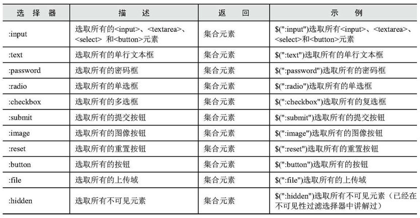

##Chapter2 JQuery Selector

###1. What is JQuery selector?
1. CSS selector
  * tag selector
  * id selector
  * class selector
  * group selector
  * descendant selector
  * `*` selector
  * pseudo selector
  * child selector
  * sibling selector
  * attribute selector
2. JQuery selector

  JQuery选择器完全继承了CSS的风格，利用JQuery选择器，可以非常便捷快速的找出特定的DOM元素。然后添加行为，不需要担心浏览器是否支持。JQuery中涉及操作CSS的部分比单纯的CSS功能更加强大，并且有拥有跨浏览器的兼容性。

3. JQuery选择器的优势
  1. 简介的写法： `$('#ID')`
  2. 支持CSS1到CSS3的选择器，而且也提供了独立的选择器。
  3. 完善的处理机制
  
    document.getElementById('tt').style.color // here it might have error since we need determine whether the tt id element exists or not.
    $('#tt').css('color', 'red'); // here, JQuery will not send error
    // Notice here: $()获取的元素永远是对象，即使网页上没有此元素，所以我们用JQuery检查某个元素在网页上是否存在时，不能使用以下代码
    if($('#tt'))
    // 我们要根据长度来判断
    if($('#tt').length > 0)
    // 或者我们转化成DOM来判断
    if($('#tt')[0])
  

4. JQuery Selector
  * 基本选择器: by id, class, and tag name
  * 层次选择器: by relationship, like child, descendant, siblings etc.
  * 过滤选择器
  * 表单选择器

###2 基本选择器

|selector | details | return | example|
|:---:|---|---|---|
|`#id` | | return one element | `$('#test')`|
|`.class` | | return a collection | `$('.name')`|
|`element` | | return a collection | `$('div')`|
|`* `| | return all | `$('*')`|
|`slector1, ..` | | return a collection | `$('div, .name')`|

###3 层次选择器
  通过DOM元素之间的层次关系来获取特定的元素。

|selector | details | return | example|
|:---:|---|---|---|
|`$('ancestor descendant')` | get all the descendants | return a collection | `$('div span')`|
|`$('parent > child')` | get the child | return a collection | `$('div span')`|
|`$('prev + next')` | 选取紧接在prev元素后的next元素 | return a collection | `$('.one div')` 选取`class`为`one`的下一个`div`同辈元素|
|`$('prev ~ siblings')` | return the after siblings | return a collection | `$('#two ~ div')`|

  后两个方法有相对简单的方法可以代替:

|selector | method|
|---|---|
|`$('.one + div')` | `$('.one').next('div')`|
|`$('#.prev ~ div')` | `$('#prev').nextAll('div')`|

***Notice:***
  `siblings()` will get all the siblings no matter it is before or after.

###4 过滤选择器
  主要是通过特定的过滤规则来筛选出所需要的DOM元素，过滤规则与CSS中的伪类选择器语法相似，就是选择都是以一个:开头

####1. 基本过滤选择器
|selector | details | return | example|
|---|---|---|---|
|`:first` | first one | single element | `$('div:first')`, 选取所有第一个`div`元素|
|`:last` | last one | single element | `$('div:last')`|
|`:not(selector)` | 去除所有与给定选择器匹配的元素 | a collection | `$('input:not(.myClass)')`, 选取`class`不是`myClass`的`<input>`元素|
|`:even` | 选取索引是偶数的所有元素,from index 0 | a collection | `$('input:even')`|
|`:odd` | 奇数 | a collection | `$('input:odd')`|
|`:eq(index)` | 选取特定index的元素，from 0 | single element | `$('input:eq(0)')`|
|`:gt(index)` | | a collection | `$('input:gt(1)')`|
|`:lt(index)` | | a collection | `$('input:lt(1)')`|
|`:header `| 选取所有的标题元素 | a collection | `$(':header')`|
|`:animated` | 选取所有的正在执行动画的元素 | a collection | `$('div:animated')`|
|`:focus` | 选取当前获取焦点的元素 | 集合元素 | `$(':focus')`|

####2. 内容过滤选择器
  这个规则主要体现在他所包含的子元素或文本内容上。

|selector | details | return | example|
|---|---|---|---|
|`:contains(text)` | 选取含有文本内容为text的元素 | a collection | `$('div:contains("mi")')`|
|`:empty` | 选取不包含子元素或者文本的空元素 | a collection | `$('div:empty')`|
|`:has(selector)` | 选取含有选择器所匹配元素的元素 | a collection | `$('div:has(p)')`, 选取的是`div`元素 |
|`:parent` | 选取含有子元素或者文本的元素 | a collection | `$('div:parent')`, 选取有子元素（包括文本元素）的`div`元素 |

####3. 可见性过滤选择器
  这个是根据元素的可见和不可见状态来选择相应的元素。

|selector | details | return | example|
|---|---|---|---|
|`:hidden` | 选取所有不可见的元素 | a collection | `$(':hidden')`选取所有不可见的元素，包括`<input type='hidden'/>`, `
`, `
`, 如果想选择`input`元素，那么可以使用`$('input:hidden')`.|
|`:visible` | 选取所有可见的元素 | a collection | `$('div:visible')`选取所有可见的div元素|

####4. 属性过滤选择器
  是通过元素的属性来获取相应的元素。

|selector | details | return | example|
|---|---|---|---|
|`[attribute]` | 获取拥有此属性的元素 | a collection | `$('div[id]')`, 有id的div元素|
|`[attribute=value]` | 选取属性的值为value的元素 | a collection | `$('div[title=test]')`|
|`[attribute!=value]` | 不等于value属性的元素 | a collection | `$('div[title!=test]')`, notice: 没有title属性的div也会被选中|
|`[attribute^=value]` | 以value开始属性值的元素 | a collection | |
|`[attribute$=value]` | 以value结尾属性值的元素 | a collection | |
|`[attribute*=value]` | 选取属性的值含有value的元素 | a collection | |
|`[attributeOR=value]` | 选取属性等于给定字符串或以该字符串为前缀(该字符串后面跟一个连字符'-')的元素 | a collection | |
|`[attribute~=value]` | 选取属性用空格分隔的值中包含一个给定的值的元素 | a collection | |
|`[attribute1][atrribute2]` | 用属性选择器合并成一个复杂的属性选择器 | a collection | `$("div[id][title$='test']")`|

####5. 子元素过滤选择器

|selector | details | return | example|
|---|---|---|---|
|`:nth-child(index/even/odd/equation)` | 选取每个父元素下的第index个元素或者奇偶元素(index from 1) | a collection | `:eq(index)`只匹配一个元素，而`nth-child`将为每一个父元素匹配子元素, 并且`:nth-child(index)`的index is from 1, `:eq(index)` is from 0.|
|`:first-child` | 选取每个父元素的第一个子元素 | a collection | `:first` 只返回单个元素，而`:first-child`将为每一个父元素匹配第一个子元素，`$('ul li:first-child')`, 选取每个`ul`中第一个`li`元素|
|`:last-child`| 选取每个父元素最后一个子元素 | a collection | `:last`只返回单个元素，而`:last-child`将为每一个父元素返回最后一个子元素|
|`:only-child` | 如果某个元素是它父元素中唯一的子元素，那么将会被匹配 | a collection | `$('ul li:only-child')`在`ul`中选取唯一子元素的`li`元素 |

***Notice:***
  We have some different here, if the selector like this:
  
    $('ul li:first-child') // indicate that the parent is ul, find the first li, li is the child
    $('ul li :first-child') // indicate the parent is ul li, find the first child element in the li, if has.
  

####6. 表单对象属性过滤选择器
  此选择器主要是对所选择的表单元素进行过滤，例如选择被选中的下拉框，多选框等元素。

selector | details | return | example|
|---|---|---|---|
|`:enabled` | 选取所有可用的元素 | a collection | `$('#form1 :enabled')`选取`id`为`form1`的表单内的所有可用的元素|
|`:disabled` | 选取所有不可用的元素 | a collection | `$('#form1 :disabled')`|
|`:checked` | 选取所有被选中的元素(包括单选框，复选框) | a collection | `$('input:checked')`|
|`:selected` | 选中所有被选中的选项元素(下拉列表) | a collection | `$('select option:selected')`|

###5. 表单选择器
  

###6 选择其中的一些注意事项

####1. 选择其中含有特殊符号的注意事项
* 选择器中含有`.#(]`等特殊符号
  
    

  

####2. 选择器中含有空格的注意事项
  有空格就是父辈，相当于一个后代选择器，而没有空格，就是过滤选择器，就像我在前面说的一样

###7 实例中用到的一些JQuery函数
  * `show()`
  * `css(name, value)`
  * `text(string)`
  * `filter(expr)`: 筛选元素
  * `addClass(class)`
  * `find(expr)`: 在元素内寻找匹配的元素
